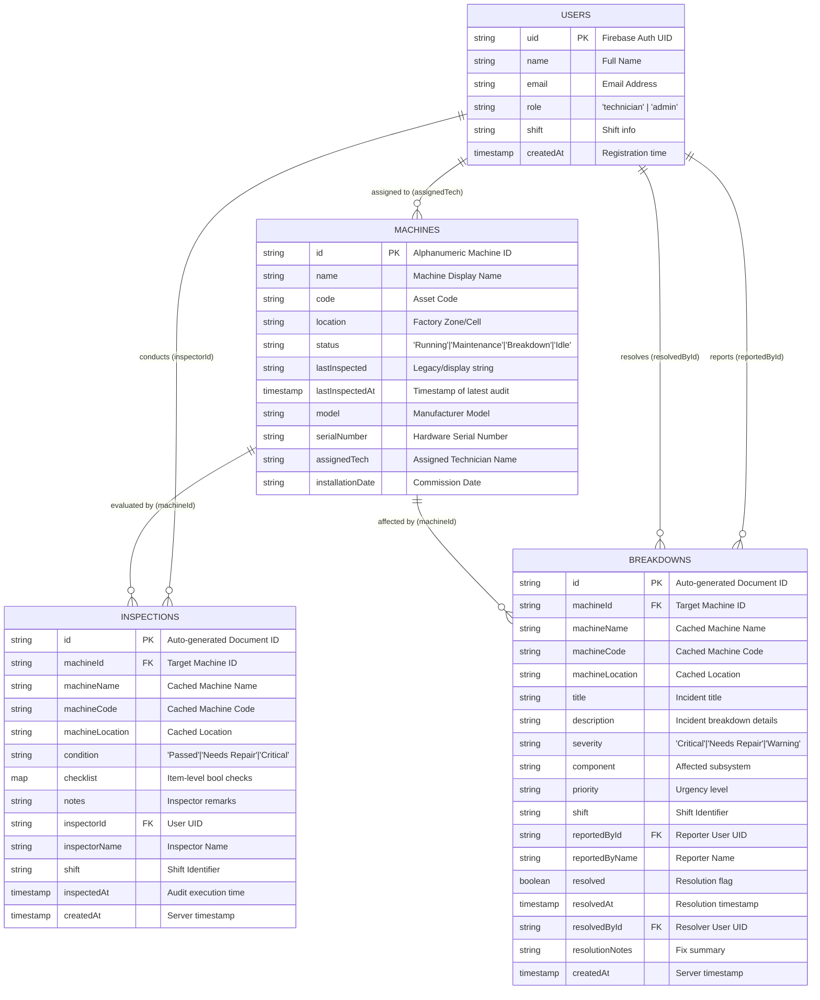

# MachineTrack Firestore Database Schema Documentation

> **Sprint 2 Architecture Specification**  
> **Database:** Google Cloud Firestore (NoSQL Document Store)  
> **Author:** Database / Firestore Developer (Steve)  
> **Target App:** MachineTrack (Flutter Factory Machine Inspection & Breakdown Management)  
> **Status:** MVP Ready & Production-Aligned

---

## 1. Executive Summary

This document specifies the complete Cloud Firestore database schema for the **MachineTrack** industrial machine tracking and audit logging platform.

### Core Principles
1. **Normalized vs. Denormalized Balance:** Documents store foreign keys (`machineId`, `inspectorId`, `reportedById`) for relational integrity while denormalizing essential read-heavy display fields (`machineName`, `machineCode`, `inspectorName`) to avoid multi-document reads in high-frequency list and card views.
2. **Proper Timestamps:** Firestore `Timestamp` objects (`Timestamp.fromDate(...)` / `FieldValue.serverTimestamp()`) are used exclusively for persistent date and time fields. Dynamic relative display strings (such as *"25 mins ago"* or *"Yesterday"*) are computed on the frontend client at render time.
3. **Audit Trail Immutability:** Inspections and breakdown records are immutable logs. Historical records cannot be modified once committed, preserving compliance integrity.
4. **Zero Frontend Breaking Changes:** Field naming, casing, and data types match the frontend Dart models (`Machine`, `Inspection`, `Breakdown`, `UserProfile`) and existing backend validation rules.

---

## 2. Architecture Overview & ER Diagram



---

## 3. Collections Specification

The database utilizes four root-level collections:
1. `users`
2. `machines`
3. `inspections`
4. `breakdowns`

---

### 3.1 Collection: `users`

Represents user profiles for technicians, operators, and administrators.

* **Collection Path:** `/users`
* **Document ID Strategy:** **Firebase Auth UID** (`request.auth.uid`). Guarantees 1:1 mapping between Firebase Authentication credentials and user data profiles.

#### Fields

| Field Name | Data Type | Required / Optional | Purpose | Constraints & Example |
| :--- | :--- | :--- | :--- | :--- |
| `uid` | `string` | Optional *(Redundant)* | Document identifier matching Auth UID. Can be omitted inside document data since document key is the UID. | `"usr_mukthar_01"` |
| `name` | `string` | **Required** | Full name of the team member. Displayed in inspector tags and reporter signatures. | Max 100 chars.<br>Ex: `"Mukthar Ahmad"` |
| `email` | `string` | **Required** | Email address of the user. Must match the authenticated Firebase user email. | Valid email format.<br>Ex: `"mukthar@factory.com"` |
| `role` | `string` | **Required** | Access control role. Controls administrative permissions. | Allowed: `'technician'`, `'admin'`<br>Default: `'technician'` |
| `shift` | `string` | Optional | Designated work shift timing. | Max 100 chars.<br>Ex: `"Shift #1 (08:00 - 16:00)"` |
| `createdAt` | `timestamp` | **Required** | Timestamp when the profile record was created. | `FieldValue.serverTimestamp()` |

---

### 3.2 Collection: `machines`

Represents the physical machinery and equipment inventory deployed across factory zones.

* **Collection Path:** `/machines`
* **Document ID Strategy:** **Natural Machine Code or Semantic ID** (e.g., `"1"`, `"PRESS-01"`, `"CNC-LTH-02"`). Provides deterministic URL routing and barcode/QR lookup compatibility.

#### Fields

| Field Name | Data Type | Required / Optional | Purpose | Constraints & Example |
| :--- | :--- | :--- | :--- | :--- |
| `name` | `string` | **Required** | Human-readable machine name. | Max 100 chars.<br>Ex: `"Hydraulic Press 500T"` |
| `code` | `string` | **Required** | Unique factory asset code. | Max 50 chars.<br>Ex: `"PRESS-500T-04"` |
| `location` | `string` | **Required** | Factory physical floor location/zone. | Max 100 chars.<br>Ex: `"Zone A - Stamping Line"` |
| `status` | `string` | **Required** | Current operational status of the machine. | Allowed: `'Running'`, `'Maintenance'`, `'Breakdown'`, `'Idle'`<br>Default: `'Idle'` |
| `lastInspectedAt` | `timestamp` | **Recommended** | **Canonical source of truth** for when this machine was last inspected. Updated by backend triggers / inspection writes. | Firestore `Timestamp`.<br>Ex: `Timestamp(seconds=1728108000, nanoseconds=0)` |
| `lastInspected` | `string` | Optional *(Legacy)* | Optional fallback display string for backward compatibility with initial mocks. | Display string.<br>Ex: `"25 mins ago"` |
| `model` | `string` | Optional | Manufacturer equipment model name/number. | Max 100 chars.<br>Ex: `"StamperPro 500"` |
| `serialNumber` | `string` | Optional | Manufacturer hardware serial number. | Max 100 chars.<br>Ex: `"SN-99812-A"` |
| `assignedTech` | `string` | Optional | Primary technician or team lead assigned to machine maintenance. | Max 100 chars.<br>Ex: `"Mukthar Ahmad"` |
| `installationDate` | `string` | Optional | Commissioning / installation date. | Free-form date string.<br>Ex: `"12 Jan 2024"` |

#### Important Architectural Decision: `lastInspected` vs. `lastInspectedAt`
* **Storage Standard:** Persist actual inspection occurrences using `lastInspectedAt` as a Firestore `Timestamp`.
* **Dynamic Client Rendering:** Avoid storing relative strings like `"25 mins ago"` into persistent storage because they immediately become stale as time elapses without an update. The Flutter client utilizes `Machine.formatRelativeTime(machine.lastInspectedAt)` to dynamically calculate `"Just now"`, `"25 mins ago"`, `"Yesterday"`, or `"23 Sep 2026"` based on local client clock.
* **Backward Compatibility:** `lastInspected` is retained as an optional string in the schema to support seed scripts and graceful offline fallback.

---

### 3.3 Collection: `inspections`

Represents structured routine maintenance audits, shift handovers, and safety checklist logs.

* **Collection Path:** `/inspections`
* **Document ID Strategy:** **Auto-generated Firestore ID** (`db.collection('inspections').doc().id`). Ensures high-throughput append performance and avoids collision during simultaneous shift audits.

#### Fields

| Field Name | Data Type | Required / Optional | Purpose | Constraints & Example |
| :--- | :--- | :--- | :--- | :--- |
| `machineId` | `string` | **Required** | Foreign key linking to target document in `/machines`. | Non-empty string. Target machine must exist.<br>Ex: `"PRESS-01"` |
| `machineName` | `string` | **Required** | Denormalized machine name for fast card display without joining `/machines`. | Max 100 chars.<br>Ex: `"Hydraulic Press 500T"` |
| `machineCode` | `string` | **Required** | Denormalized machine code for fast identification. | Max 50 chars.<br>Ex: `"PRESS-500T-04"` |
| `machineLocation` | `string` | Optional | Denormalized machine location. | Max 100 chars.<br>Ex: `"Zone A - Stamping Line"` |
| `condition` | `string` | **Required** | Overall audit condition result (maps to `result` / `status` in UI). | Allowed: `'Passed'`, `'Needs Repair'`, `'Critical'` |
| `checklist` | `map<string, bool>` | **Required** | Itemized audit checklist tests and their boolean completion states. | Max 50 checklist items.<br>Ex: `{"Hydraulic Fluid Level": true, "Emergency Stop Operational": true, "Pressure Seal Leak-Free": false}` |
| `notes` | `string` | Optional | Freeform observations and technical notes from the inspector. | Max 2000 chars.<br>Ex: `"Slight pressure fluctuation observed on valve B. Recommend servicing next shift."` |
| `inspectorId` | `string` | **Required** | Firebase Auth UID of the technician submitting the report. | Must equal `request.auth.uid`.<br>Ex: `"usr_mukthar_01"` |
| `inspectorName` | `string` | **Required** | Full name of the inspector for attribution. | Max 100 chars.<br>Ex: `"Mukthar Ahmad"` |
| `shift` | `string` | Optional | Working shift during which inspection was performed. | Max 100 chars.<br>Ex: `"Shift #1 (08:00 - 16:00)"` |
| `inspectedAt` | `timestamp` | **Required** | Actual date and time when the audit was performed. | Firestore `Timestamp` |
| `createdAt` | `timestamp` | **Required** | Server recording timestamp for auditing. | Firestore `Timestamp` (`FieldValue.serverTimestamp()`) |

---

### 3.4 Collection: `breakdowns`

Represents unplanned failures, incidents, hardware malfunctions, or emergency line halts.

* **Collection Path:** `/breakdowns`
* **Document ID Strategy:** **Auto-generated Firestore ID** (`db.collection('breakdowns').doc().id`).

#### Fields

| Field Name | Data Type | Required / Optional | Purpose | Constraints & Example |
| :--- | :--- | :--- | :--- | :--- |
| `machineId` | `string` | **Required** | Foreign key linking to target document in `/machines`. | Non-empty string. Target machine must exist.<br>Ex: `"PRESS-01"` |
| `machineName` | `string` | **Required** | Denormalized machine name. | Max 100 chars.<br>Ex: `"Hydraulic Press 500T"` |
| `machineCode` | `string` | **Required** | Denormalized machine code. | Max 50 chars.<br>Ex: `"PRESS-500T-04"` |
| `machineLocation` | `string` | Optional | Denormalized factory location. | Max 100 chars.<br>Ex: `"Zone A - Stamping Line"` |
| `title` | `string` | **Required** | Brief headline summarizing the breakdown incident. | Max 150 chars.<br>Ex: `"Hydraulic Seal Rupture"` |
| `description` | `string` | **Required** | Detailed description of the breakdown symptoms, root cause, and immediate hazards. | Max 2000 chars.<br>Ex: `"Main cylinder pressure dropped below 50 bar. Hydraulic oil pooling under stamping plate."` |
| `severity` | `string` | **Required** | Criticality of the failure (maps to `status` in active records UI). | Allowed: `'Critical'`, `'Needs Repair'`, `'Warning'` |
| `component` | `string` | Optional | Specific subsystem or affected mechanical/electrical component (`affectedSubsystem`). | Max 100 chars.<br>Ex: `"Main Hydraulic Valve & Seals"` |
| `priority` | `string` | Optional | Factory operational urgency level. | Max 50 chars.<br>Ex: `"Urgent / Line Halt"`, `"High"`, `"Medium"` |
| `shift` | `string` | Optional | Shift during which failure occurred. | Max 100 chars.<br>Ex: `"Shift #2 (16:00 - 00:00)"` |
| `reportedById` | `string` | **Required** | Firebase Auth UID of the reporter. | Must equal `request.auth.uid`.<br>Ex: `"usr_mukthar_01"` |
| `reportedByName` | `string` | **Required** | Full name of the reporter. | Max 100 chars.<br>Ex: `"Mukthar Ahmad"` |
| `resolved` | `boolean` | **Required** | Indicates whether breakdown has been repaired and verified. | Initial value must be `false`. Set to `true` upon resolution. |
| `resolvedAt` | `timestamp` | Optional | Timestamp when resolution was logged. | Set upon resolution.<br>Ex: `Timestamp` |
| `resolvedById` | `string` | Optional | UID of technician or administrator who resolved the issue. | Must equal `request.auth.uid` when resolving.<br>Ex: `"usr_steve_02"` |
| `resolutionNotes` | `string` | Optional | Technical explanation of repairs performed to bring machine back online. | Max 2000 chars.<br>Ex: `"Replaced secondary pressure seal ring and refilled hydraulic fluid. Tested at 500T with zero leakage."` |
| `createdAt` | `timestamp` | **Required** | Server timestamp when incident was reported. | Firestore `Timestamp` (`FieldValue.serverTimestamp()`) |

---

## 4. Entity Relationships & Data Integrity

```
+---------------------------------------------------------------------------------+
|                                 RELATIONSHIP MAP                                |
+-------------------+--------------------+------------------+---------------------+
| From Collection   | To Collection      | Cardinality      | Reference Mechanism |
+-------------------+--------------------+------------------+---------------------+
| users             | machines           | 1 to N / N to M  | machines.assignedTech (Name/UID)
| users             | inspections        | 1 to N           | inspections.inspectorId == users.uid
| users             | breakdowns         | 1 to N           | breakdowns.reportedById == users.uid
| users             | breakdowns (resolv)| 1 to N           | breakdowns.resolvedById == users.uid
| machines          | inspections        | 1 to N           | inspections.machineId == machines.id
| machines          | breakdowns         | 1 to N           | breakdowns.machineId == machines.id
+-------------------+--------------------+------------------+---------------------+
```

### Relationship Rules
1. **`users` -> `machines`:**
   * A machine can be assigned to a technician (`assignedTech`). For the MVP, storing the technician's name or UID in `assignedTech` allows filtering fleet lists by assigned worker.
2. **`users` -> `inspections`:**
   * One-to-Many. Every inspection stores `inspectorId` (the user's UID) for audit accountability, alongside a denormalized `inspectorName` for display performance.
3. **`users` -> `breakdowns`:**
   * One-to-Many. Every breakdown stores `reportedById` (the user's UID). When the breakdown is resolved, `resolvedById` stores the UID of the technician who closed it.
4. **`machines` -> `inspections`:**
   * One-to-Many. Every inspection references a single parent machine via `machineId`. A machine accumulates an audit history over its lifecycle.
5. **`machines` -> `breakdowns`:**
   * One-to-Many. Every breakdown references a single parent machine via `machineId`.
6. **Denormalization Strategy:**
   * Fields `machineName`, `machineCode`, and `machineLocation` are denormalized inside both `inspections` and `breakdowns`. This allows the Records Feed and Recent Activity widgets to render without having to fetch the corresponding `/machines/{id}` documents for each record.

---

## 5. Sample Documents (MVP Reference Examples)

*(Note: The following documents are illustrative schema examples for documentation and automated testing purposes; do not manually inject dummy records into live production databases).*

### 5.1 Sample Documents: `machines` (5 Examples)

#### Document 1: `/machines/1`
```json
{
  "name": "Hydraulic Press 500T",
  "code": "PRESS-500T-04",
  "location": "Zone A - Stamping Line",
  "status": "Breakdown",
  "lastInspectedAt": {
    "_seconds": 1759491000,
    "_nanoseconds": 0
  },
  "lastInspected": "25 mins ago",
  "model": "StamperPro 500",
  "serialNumber": "SN-99812-A",
  "assignedTech": "Mukthar Ahmad",
  "installationDate": "12 Jan 2024"
}
```

#### Document 2: `/machines/2`
```json
{
  "name": "CNC Lathe Machine #02",
  "code": "CNC-LTH-02",
  "location": "Zone B - Machining Cell",
  "status": "Running",
  "lastInspectedAt": {
    "_seconds": 1759484700,
    "_nanoseconds": 0
  },
  "lastInspected": "2 hours ago",
  "model": "LatheMatic 3000",
  "serialNumber": "SN-44310-B",
  "assignedTech": "Abhinav Patel",
  "installationDate": "04 Mar 2023"
}
```

#### Document 3: `/machines/3`
```json
{
  "name": "Automated Conveyor Belt #05",
  "code": "CNV-BELT-05",
  "location": "Zone C - Packaging Line",
  "status": "Maintenance",
  "lastInspectedAt": {
    "_seconds": 1759404600,
    "_nanoseconds": 0
  },
  "lastInspected": "Yesterday",
  "model": "ConveyX Ultra",
  "serialNumber": "SN-11204-C",
  "assignedTech": "Steve Antony",
  "installationDate": "18 Aug 2023"
}
```

#### Document 4: `/machines/4`
```json
{
  "name": "Robotic Welding Arm Alpha",
  "code": "ROB-WLD-01",
  "location": "Zone A - Welding Bay",
  "status": "Running",
  "lastInspectedAt": {
    "_seconds": 1759481100,
    "_nanoseconds": 0
  },
  "lastInspected": "3 hours ago",
  "model": "WeldBot 900",
  "serialNumber": "SN-77291-A",
  "assignedTech": "Mukthar Ahmad",
  "installationDate": "10 Nov 2023"
}
```

#### Document 5: `/machines/5`
```json
{
  "name": "Injection Molding Unit #03",
  "code": "INJ-MLD-03",
  "location": "Zone D - Plastics Sector",
  "status": "Idle",
  "lastInspectedAt": {
    "_seconds": 1759231800,
    "_nanoseconds": 0
  },
  "lastInspected": "3 days ago",
  "model": "MoldMaster Pro",
  "serialNumber": "SN-55612-D",
  "assignedTech": "Abhinav Patel",
  "installationDate": "22 May 2022"
}
```

---

### 5.2 Sample Documents: `inspections` (3 Examples)

#### Document 1: `/inspections/insp_101`
```json
{
  "machineId": "2",
  "machineName": "CNC Lathe Machine #02",
  "machineCode": "CNC-LTH-02",
  "machineLocation": "Zone B - Machining Cell",
  "condition": "Passed",
  "checklist": {
    "Spindle Bearing Alignment": true,
    "Coolant Flow Rate Normal": true,
    "Emergency Stop Operational": true,
    "Safety Door Interlock Functioning": true
  },
  "notes": "Spindle and coolant channels operating smoothly within normal vibration limits.",
  "inspectorId": "usr_mukthar_01",
  "inspectorName": "Mukthar Ahmad",
  "shift": "Shift #1 (08:00 - 16:00)",
  "inspectedAt": {
    "_seconds": 1759484700,
    "_nanoseconds": 0
  },
  "createdAt": {
    "_seconds": 1759484705,
    "_nanoseconds": 0
  }
}
```

#### Document 2: `/inspections/insp_102`
```json
{
  "machineId": "3",
  "machineName": "Automated Conveyor Belt #05",
  "machineCode": "CNV-BELT-05",
  "machineLocation": "Zone C - Packaging Line",
  "condition": "Needs Repair",
  "checklist": {
    "Roller Bearing Lubrication": true,
    "Belt Tension Within Specs": false,
    "Motor Housing Temperature": true,
    "Optical Sensor Alignment": true
  },
  "notes": "Belt tension loose near zone C drive sprocket. Moderate slippage under full pallet load.",
  "inspectorId": "usr_steve_02",
  "inspectorName": "Steve Antony",
  "shift": "Shift #2 (16:00 - 00:00)",
  "inspectedAt": {
    "_seconds": 1759404600,
    "_nanoseconds": 0
  },
  "createdAt": {
    "_seconds": 1759404610,
    "_nanoseconds": 0
  }
}
```

#### Document 3: `/inspections/insp_103`
```json
{
  "machineId": "1",
  "machineName": "Hydraulic Press 500T",
  "machineCode": "PRESS-500T-04",
  "machineLocation": "Zone A - Stamping Line",
  "condition": "Critical",
  "checklist": {
    "Hydraulic Line Integrity": false,
    "Pressure Gauge Calibration": false,
    "Light Curtain Safety Barrier": true,
    "Emergency Stop Operational": true
  },
  "notes": "Severe pressure drop in main valve manifold. High risk of seal blow-out. Machine halted immediately.",
  "inspectorId": "usr_mukthar_01",
  "inspectorName": "Mukthar Ahmad",
  "shift": "Shift #1 (08:00 - 16:00)",
  "inspectedAt": {
    "_seconds": 1759491000,
    "_nanoseconds": 0
  },
  "createdAt": {
    "_seconds": 1759491008,
    "_nanoseconds": 0
  }
}
```

---

### 5.3 Sample Documents: `breakdowns` (3 Examples)

#### Document 1: `/breakdowns/brk_201` *(Active Critical Breakdown)*
```json
{
  "machineId": "1",
  "machineName": "Hydraulic Press 500T",
  "machineCode": "PRESS-500T-04",
  "machineLocation": "Zone A - Stamping Line",
  "title": "Main Cylinder Hydraulic Seal Rupture",
  "description": "High pressure oil jet spraying from secondary cylinder coupling. Emergency stop triggered. Line halted.",
  "severity": "Critical",
  "component": "Main Cylinder Hydraulic Manifold",
  "priority": "Urgent / Line Halt",
  "shift": "Shift #1 (08:00 - 16:00)",
  "reportedById": "usr_mukthar_01",
  "reportedByName": "Mukthar Ahmad",
  "resolved": false,
  "createdAt": {
    "_seconds": 1759491600,
    "_nanoseconds": 0
  }
}
```

#### Document 2: `/breakdowns/brk_202` *(Active Warning/Needs Repair Incident)*
```json
{
  "machineId": "3",
  "machineName": "Automated Conveyor Belt #05",
  "machineCode": "CNV-BELT-05",
  "machineLocation": "Zone C - Packaging Line",
  "title": "Drive Roller Bearing Overheating",
  "description": "Thermal camera reading 82C on drive motor tail pulley. High-pitched squeal detected under load.",
  "severity": "Needs Repair",
  "component": "Drive Pulley Bearing",
  "priority": "Medium",
  "shift": "Shift #2 (16:00 - 00:00)",
  "reportedById": "usr_steve_02",
  "reportedByName": "Steve Antony",
  "resolved": false,
  "createdAt": {
    "_seconds": 1759410000,
    "_nanoseconds": 0
  }
}
```

#### Document 3: `/breakdowns/brk_203` *(Resolved Incident)*
```json
{
  "machineId": "4",
  "machineName": "Robotic Welding Arm Alpha",
  "machineCode": "ROB-WLD-01",
  "machineLocation": "Zone A - Welding Bay",
  "title": "Wire Feed Drive Jamming",
  "description": "Feed motor stopped feeding welding wire due to spool tension tangle.",
  "severity": "Warning",
  "component": "Wire Feeder Unit",
  "priority": "Medium",
  "shift": "Shift #1 (08:00 - 16:00)",
  "reportedById": "usr_mukthar_01",
  "reportedByName": "Mukthar Ahmad",
  "resolved": true,
  "resolvedAt": {
    "_seconds": 1759483200,
    "_nanoseconds": 0
  },
  "resolvedById": "usr_steve_02",
  "resolutionNotes": "Cleared entangled wire spool, cleaned drive rollers, and calibrated feed tension. System verified operational.",
  "createdAt": {
    "_seconds": 1759479600,
    "_nanoseconds": 0
  }
}
```

---

### 5.4 Sample Documents: `users` (2 Examples)

#### Document 1: `/users/usr_mukthar_01` *(Technician)*
```json
{
  "name": "Mukthar Ahmad",
  "email": "mukthar@factory.com",
  "role": "technician",
  "shift": "Shift #1 (08:00 - 16:00)",
  "createdAt": {
    "_seconds": 1735689600,
    "_nanoseconds": 0
  }
}
```

#### Document 2: `/users/usr_steve_02` *(Administrator)*
```json
{
  "name": "Steve Antony",
  "email": "steve@factory.com",
  "role": "admin",
  "shift": "Shift #2 (16:00 - 00:00)",
  "createdAt": {
    "_seconds": 1735689600,
    "_nanoseconds": 0
  }
}
```

---

## 6. Required Application Queries & Composite Indexes

### 6.1 Core Queries

#### Query 1: Get All Machines
* **Purpose:** Powers the fleet grid/list on the Machines screen.
* **Code Example (Dart):**
  ```dart
  FirebaseFirestore.instance
      .collection('machines')
      .get();
  ```

#### Query 2: Get Machine by ID
* **Purpose:** Loads specific machine metadata on the Machine Details screen.
* **Code Example (Dart):**
  ```dart
  FirebaseFirestore.instance
      .collection('machines')
      .doc(machineId)
      .get();
  ```

#### Query 3: Real-Time Machine Updates
* **Purpose:** Live status badge changes across the fleet dashboard.
* **Code Example (Dart):**
  ```dart
  FirebaseFirestore.instance
      .collection('machines')
      .snapshots();
  ```

#### Query 4: Get Inspections for a Specific Machine
* **Purpose:** Audit history tab on the Machine Details screen.
* **Code Example (Dart):**
  ```dart
  FirebaseFirestore.instance
      .collection('inspections')
      .where('machineId', '==', machineId)
      .orderBy('createdAt', descending: true)
      .snapshots();
  ```

#### Query 5: Get Breakdowns for a Specific Machine
* **Purpose:** Incident history tab on the Machine Details screen.
* **Code Example (Dart):**
  ```dart
  FirebaseFirestore.instance
      .collection('breakdowns')
      .where('machineId', '==', machineId)
      .orderBy('createdAt', descending: true)
      .snapshots();
  ```

#### Query 6: Get Recent Records (Combined Audit Feed)
* **Purpose:** Activity feed on the Records Screen and Home Screen.
* **Code Example (Dart):**
  ```dart
  // Inspections feed
  FirebaseFirestore.instance
      .collection('inspections')
      .orderBy('createdAt', descending: true)
      .limit(50)
      .snapshots();

  // Breakdowns feed
  FirebaseFirestore.instance
      .collection('breakdowns')
      .orderBy('createdAt', descending: true)
      .limit(50)
      .snapshots();
  ```

#### Query 7: Filter Records by Resolution / Open Status
* **Purpose:** Shows unresolved breakdowns requiring engineering attention.
* **Code Example (Dart):**
  ```dart
  FirebaseFirestore.instance
      .collection('breakdowns')
      .where('resolved', '==', false)
      .orderBy('createdAt', descending: true)
      .snapshots();
  ```

#### Query 8: Filter Records by Severity or Condition
* **Purpose:** Filter breakdowns by critical severity or inspections by failure.
* **Code Example (Dart):**
  ```dart
  FirebaseFirestore.instance
      .collection('breakdowns')
      .where('severity', '==', 'Critical')
      .orderBy('createdAt', descending: true)
      .snapshots();
  ```

---

### 6.2 Required Firestore Composite Indexes

When querying Firestore with equality operators (`where`) combined with inequality or range ordering (`orderBy`), Firestore requires composite indexes.

The following composite indexes are defined in `backend/firestore.indexes.json`:

```json
{
  "indexes": [
    {
      "collectionGroup": "inspections",
      "queryScope": "COLLECTION",
      "fields": [
        { "fieldPath": "machineId", "order": "ASCENDING" },
        { "fieldPath": "createdAt", "order": "DESCENDING" }
      ]
    },
    {
      "collectionGroup": "inspections",
      "queryScope": "COLLECTION",
      "fields": [
        { "fieldPath": "inspectorId", "order": "ASCENDING" },
        { "fieldPath": "createdAt", "order": "DESCENDING" }
      ]
    },
    {
      "collectionGroup": "breakdowns",
      "queryScope": "COLLECTION",
      "fields": [
        { "fieldPath": "machineId", "order": "ASCENDING" },
        { "fieldPath": "createdAt", "order": "DESCENDING" }
      ]
    },
    {
      "collectionGroup": "breakdowns",
      "queryScope": "COLLECTION",
      "fields": [
        { "fieldPath": "resolved", "order": "ASCENDING" },
        { "fieldPath": "createdAt", "order": "DESCENDING" }
      ]
    }
  ],
  "fieldOverrides": []
}
```

---

## 7. MVP Firestore Security Rules

The security rules enforce schema validation, field whitelisting, role-based access control, and audit immutability directly on Firestore.

### 7.1 Security Architecture Principles
1. **Authenticated Access:** Only authenticated users (`request.auth != null`) can read or write documents.
2. **Role Verification:** Administrator rights are verified via `users/{uid}.role == 'admin'`.
3. **Machine Management:** Only admins can add, update, or delete machines in the catalog. Status sync occurs via secure Cloud Functions.
4. **Immutable Inspections:** Any authenticated technician can log an inspection with their own UID, but inspections can never be altered or tampered with.
5. **Breakdown Lifecycle:** Anyone can report a breakdown; only the reporter or an admin can resolve it with resolution notes.

### 7.2 Production Rules Specification (`firestore.rules`)

```javascript
rules_version = '2';

service cloud.firestore {
  match /databases/{database}/documents {

    // ---------- Helper Functions ----------

    function signedIn() {
      return request.auth != null;
    }

    function isSelf(uid) {
      return signedIn() && request.auth.uid == uid;
    }

    function isAdmin() {
      let path = /databases/$(database)/documents/users/$(request.auth.uid);
      return signedIn() && exists(path) && get(path).data.role == 'admin';
    }

    function isString(value, maxLength) {
      return value is string && value.size() <= maxLength;
    }

    function isNonEmptyString(value, maxLength) {
      return isString(value, maxLength) && value.trim().size() > 0;
    }

    function optionalString(data, field, maxLength) {
      return !(field in data) || isString(data[field], maxLength);
    }

    function machineExists(machineId) {
      return exists(/databases/$(database)/documents/machines/$(machineId));
    }

    // Domain validation enums
    function machineStatuses() {
      return ['Running', 'Maintenance', 'Breakdown', 'Idle'];
    }

    function inspectionConditions() {
      return ['Passed', 'Needs Repair', 'Critical'];
    }

    function breakdownSeverities() {
      return ['Critical', 'Needs Repair', 'Warning'];
    }

    // ---------- users/{uid} ----------

    function validNewUser(uid, data) {
      return data.keys().hasAll(['name', 'email', 'role', 'createdAt'])
        && data.keys().hasOnly(['name', 'email', 'role', 'createdAt', 'shift'])
        && isNonEmptyString(data.name, 100)
        && data.email == request.auth.token.email
        && data.role == 'technician'
        && data.createdAt == request.time
        && optionalString(data, 'shift', 100);
    }

    match /users/{uid} {
      allow read: if signedIn();
      allow create: if isSelf(uid) && validNewUser(uid, request.resource.data);
      allow update: if (isSelf(uid)
          && request.resource.data.diff(resource.data).affectedKeys().hasOnly(['name', 'shift'])
          && isNonEmptyString(request.resource.data.name, 100)
          && optionalString(request.resource.data, 'shift', 100))
        || (isAdmin()
          && request.resource.data.diff(resource.data).affectedKeys().hasOnly(['role'])
          && request.resource.data.role in ['technician', 'admin']);
      allow delete: if false;
    }

    // ---------- machines/{machineId} ----------

    function validMachine(data) {
      return data.keys().hasAll(['name', 'code', 'location', 'status'])
        && data.keys().hasOnly([
          'name', 'code', 'location', 'status', 'lastInspected', 'lastInspectedAt',
          'model', 'serialNumber', 'assignedTech', 'installationDate'
        ])
        && isNonEmptyString(data.name, 100)
        && isNonEmptyString(data.code, 50)
        && isNonEmptyString(data.location, 100)
        && data.status in machineStatuses()
        && optionalString(data, 'lastInspected', 50)
        && (!('lastInspectedAt' in data) || data.lastInspectedAt is timestamp)
        && optionalString(data, 'model', 100)
        && optionalString(data, 'serialNumber', 100)
        && optionalString(data, 'assignedTech', 100)
        && optionalString(data, 'installationDate', 50);
    }

    match /machines/{machineId} {
      allow read: if signedIn();
      allow create, update: if isAdmin() && validMachine(request.resource.data);
      allow delete: if isAdmin();
    }

    // ---------- inspections/{inspectionId} ----------

    function validInspection(data) {
      return data.keys().hasAll([
          'machineId', 'machineName', 'machineCode', 'condition', 'checklist',
          'inspectorId', 'inspectorName', 'inspectedAt', 'createdAt'
        ])
        && data.keys().hasOnly([
          'machineId', 'machineName', 'machineCode', 'machineLocation',
          'condition', 'checklist', 'notes', 'inspectorId', 'inspectorName',
          'shift', 'inspectedAt', 'createdAt'
        ])
        && isNonEmptyString(data.machineId, 100)
        && machineExists(data.machineId)
        && isNonEmptyString(data.machineName, 100)
        && isNonEmptyString(data.machineCode, 50)
        && optionalString(data, 'machineLocation', 100)
        && data.condition in inspectionConditions()
        && data.checklist is map
        && data.checklist.size() <= 50
        && optionalString(data, 'notes', 2000)
        && data.inspectorId == request.auth.uid
        && isNonEmptyString(data.inspectorName, 100)
        && optionalString(data, 'shift', 100)
        && data.inspectedAt is timestamp
        && data.createdAt == request.time;
    }

    match /inspections/{inspectionId} {
      allow read: if signedIn();
      allow create: if signedIn() && validInspection(request.resource.data);
      allow update: if false; // Immutable audit log
      allow delete: if isAdmin();
    }

    // ---------- breakdowns/{breakdownId} ----------

    function validBreakdown(data) {
      return data.keys().hasAll([
          'machineId', 'machineName', 'machineCode', 'title', 'description',
          'severity', 'reportedById', 'reportedByName', 'resolved', 'createdAt'
        ])
        && data.keys().hasOnly([
          'machineId', 'machineName', 'machineCode', 'machineLocation', 'title',
          'description', 'severity', 'component', 'priority', 'reportedById',
          'reportedByName', 'shift', 'resolved', 'createdAt'
        ])
        && isNonEmptyString(data.machineId, 100)
        && machineExists(data.machineId)
        && isNonEmptyString(data.machineName, 100)
        && isNonEmptyString(data.machineCode, 50)
        && optionalString(data, 'machineLocation', 100)
        && isNonEmptyString(data.title, 150)
        && isNonEmptyString(data.description, 2000)
        && data.severity in breakdownSeverities()
        && optionalString(data, 'component', 100)
        && optionalString(data, 'priority', 50)
        && data.reportedById == request.auth.uid
        && isNonEmptyString(data.reportedByName, 100)
        && optionalString(data, 'shift', 100)
        && data.resolved == false
        && data.createdAt == request.time;
    }

    function validResolution(before, after) {
      return before.resolved == false
        && after.diff(before).affectedKeys()
            .hasOnly(['resolved', 'resolvedAt', 'resolvedById', 'resolutionNotes'])
        && after.resolved == true
        && after.resolvedAt == request.time
        && after.resolvedById == request.auth.uid
        && optionalString(after, 'resolutionNotes', 2000);
    }

    match /breakdowns/{breakdownId} {
      allow read: if signedIn();
      allow create: if signedIn() && validBreakdown(request.resource.data);
      allow update: if signedIn()
        && (resource.data.reportedById == request.auth.uid || isAdmin())
        && validResolution(resource.data, request.resource.data);
      allow delete: if isAdmin();
    }

    // Default catch-all deny
    match /{document=**} {
      allow read, write: if false;
    }
  }
}
```

---

## 8. Summary Table: Quick Reference for Developers

| Collection | Doc ID Strategy | Write Permission | Update Permission | Delete Permission | Key Indexes |
| :--- | :--- | :--- | :--- | :--- | :--- |
| **`users`** | Auth `uid` | User self (role `'technician'`) | Name/Shift (Self) \| Role (Admin) | Denied | Default single-field |
| **`machines`** | Alphanumeric (Code / ID) | Admin only | Admin only (Cloud Functions sync status) | Admin only | Default single-field |
| **`inspections`** | Auto-ID | Signed-in user (self `inspectorId`) | Denied (Immutable) | Admin only | `machineId ASC, createdAt DESC`<br>`inspectorId ASC, createdAt DESC` |
| **`breakdowns`** | Auto-ID | Signed-in user (self `reportedById`) | Reporter / Admin (Resolve only) | Admin only | `machineId ASC, createdAt DESC`<br>`resolved ASC, createdAt DESC` |

---
